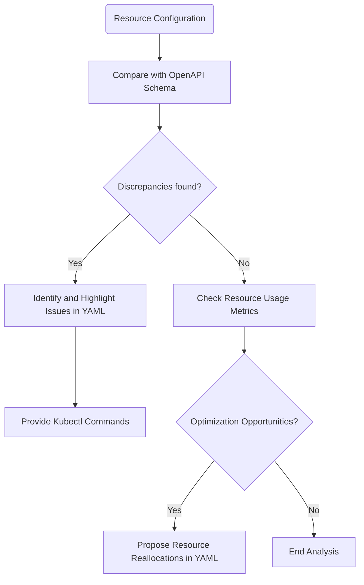

# Kubernetes Resource Troubleshooting and Optimization Guide

This guide provides an analysis of Kubernetes resources, identifies potential failures or performance improvements and guides on relevant solutions. It utilizes OpenAPI schema definitions, Prometheus metrics and container logs as part of this analysis.

## Table of Contents
- [Schema Comparison](#schema-comparison)
- [Performance Optimizations](#performance-optimizations)
- [Kubectl Commands](#kubectl-commands)
- [Mermaid Flowchart](#mermaid-flowchart)

## Schema Comparison

Let's begin by comparing your current resource definitions against the expected state defined in the OpenAPI schema. Discrepancies may indicate configuration errors or potential areas of improvement.

For example, if your `Deployment` definition in YAML format is as follows:
```yaml
apiVersion: apps/v1
kind: Deployment
metadata:
  name: nginx-deployment
  labels:
    app: nginx
spec:
  replicas: 3
  selector:
    matchLabels:
      app: nginx
  template:
    metadata:
      labels:
        app: nginx
    spec:
      containers:
      - name: nginx
        image: nginx:1.14.2
```

and the OpenAPI schema for a `Deployment` states:

> "[...], number of desired pods (replicas) can be scaled based on the system's resource usage, [...]" (`Deployment.Spec.Replicas`)

It indicates that you can tune the `replicas` part of the definition to be in line with hardware availability and system load. For more information, see [Performance Optimizations](#performance-optimizations) section below.

## Performance Optimizations

Considering Prometheus metrics, like CPU and memory usage, can guide on areas where performance improvements can be made. For instance, if your Pods are consistently using a low percentage of assigned resources, you can potentially reduce resource limits or cpu/memory requests to make more efficient use of resources. Make these changes in your YAML file:

```yaml
...
spec:
  containers:
  - name: nginx
    image: nginx:1.14.2
    resources:
      limits:
        cpu: "0.5" # Decrease as per usage metrics
        memory: "128Mi" # Decrease as per usage metrics
```
## Kubectl Commands

Kubectl provides commands to help identify and resolve issues. Here are some example commands:

To get resource configuration of deployment:

```bash
kubectl get deployments nginx-deployment -o yaml
```

To apply changes made in the YAML file:

```bash
kubectl apply -f nginx-deployment.yaml
```
## Mermaid Flowchart

Here is a flowchart showing the steps for Kubernetes resource analysis and improvements:


This flowchart can guide you to identify issues and potential optimization opportunities, and help you to resolve them efficiently.

## Conclusion

Using the steps and tools highlighted in this guide, you can perform a thorough analysis of your Kubernetes resources and take action where it's needed. The goal is to keep your Kubernetes resources running optimally and error-free!

Keep in mind, this is an iterative process. As your workloads and resources change, you may need to re-visit these steps for continuous improvement.