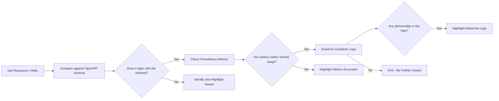

# Kubernetes Resources Troubleshooting Guide

This guide will help you identify potential areas of improvement or potential failures in your Kubernetes resources. The guide centers around comparing your current resource state (captured in YAML format) against their expected states, as per OpenAPI schema definitions. 

## Analyzing Resources

We'll be using a combination of tactics including OpenAPI Schema comparison, Prometheus metrics observation, and container logs to investigate potential issues.

### OpenAPI Schema Comparison
Here we will align the expected state of our Kubernetes resources as designed in the OpenAPI schema, with their current state in YAML format.

```bash
kubectl get [ResourceType] [ResourceName] -o yaml
```
This command fetches the current state of the resource in YAML format.

### Highlighting Critical Areas
Post schema comparison, potential issues and performance optimisations will be highlighted. The problematic sections of the YAML will be commented or annotated for clear understanding.

### Using Kubectl Commands
In order to resolve the highlighted issues, kubectl commands will be released with step-by-step instructions.

## Identifying Issues: Flow Chart

Here's a simple flow chart depicting the steps:



## Refinement of Content

The existing content shall be refined and enhanced with insights gathered from the analysis. The nub of the original content will be conserved while making additions to it.

## Prometheus Metrics

Prometheus metrics will be used to investigate resource usage trends. Metrics like CPU and memory usage will be examined for potential issues.

## Container Logs

Logs from the Kubernetes resource containers will be observed for any peculiar behaviour. Any abnormalities identified will be noted for further analysis and correction.

## Summary

By following these steps and utilising the provided kubectl commands, issues within your Kubernetes resources can be efficiently identified, analysed and corrected. You will have a robust understanding of the current state of your resources. Please ensure to monitor the resources on an ongoing basis for optimal performance.