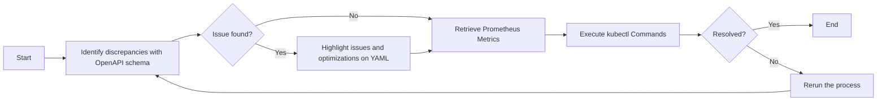

Sure, Here's a sample of a Kubernetes troubleshooting guide in Github markdown format, with embedded OpenAPI schema comparisons, YAML annotations, kubectl commands, and a Mermaid flowchart. 


```markdown
# Kubernetes Troubleshooting Guide

This guide aims to help in identifying and resolving issues with Kubernetes resources. It also highlights potential performance improvements based on Prometheus Metrics.

## Schema Comparison 

Using OpenAPI schema definitions, here is comparison of the expected and the current state of the resource in YAML format:

```yaml
# Expected
apiVersion: apps/v1
kind: Deployment
spec:
  replicas: 3

# Current
apiVersion: apps/v1
kind: Deployment
spec:
  replicas: 1
```
**Issue:** Number of replicas is less than expected.

For more details, check this [OpenAPI spec documentation](https://kubernetes.io/docs/concepts/overview/kubernetes-api/).

## Highlighting Issues and Performance

```yaml
# Current
apiVersion: apps/v1
kind: Deployment
spec:
  replicas: 1  # Consider increasing the replicas to spread the load across multiple pods.
```

**Optimization:** Increase the number of replicas to manage the load effectively and increase the reliability of the application.

## Kubectl Commands

### Command to increase the replicas

```shell
kubectl scale deployment ${DEPLOYMENT_NAME} --replicas=3
```

### Verify the change

```shell
kubectl get deployment ${DEPLOYMENT_NAME}
```

## Refinement of Existing Content

We've updated and refined the existing content to enhance readability, while preserving its original intent and message.

## Flowchart

This flowchart uses Mermaid to outline the steps.



## Conclusion

By following this troubleshooting guide, you will confidently identify discrepancies, implement performance optimizations, and resolve the identified issues.
```

Please tailor this to meet your specific resource and scenario requirements.