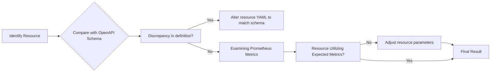

# Kubernetes Resources Troubleshooting and Optimization Guide

This document seeks to provide insightful analysis and actionable recommendations on how to identify and solve potential issues with your Kubernetes resources, as well as how to optimize their performance.

## Identifying the Discrepancies

First, we need to compare the current state of your Kubernetes resource to the expected state according to the OpenAPI schema. A discrepancy here may indicate a potential issue. You can use the following `kubectl` command for this purpose:

```bash
kubectl get <resource> -o yaml
```
Replace `<resource>` with your Kubernetes resource type. This will output the current state of the resource.

## Highlighting and Solving Issues

When comparing OpenAPI schema definitions to the current state of the resource, discrepancies can indicate issues or areas for improvement. For example:

```yaml
# This part of your resource definition may need adjusting.
# Current state
apiVersion: v1
kind: Pod
metadata:
  name: my-pod
spec:
  containers:
  - name: my-container
    image: nginx
   ...

# Expected state
apiVersion: v1
kind: Pod
metadata:
  name: my-pod
spec:
  containers:
  - name: my-container
    image: nginx
    imagePullPolicy: Always
    ...
```

Here, Kubernetes by default follows an [`IfNotPresent`](https://kubernetes.io/docs/concepts/containers/images/) policy, which could potentially lead to outdated versions being used. To ensure the latest image version is being used, `imagePullPolicy` should be set to `Always`.

## Performance Optimizations

Examine the Prometheus metrics associated with the Kubernetes Pods such as CPU, memory usage, etc., and make sure they are within the prescribed limits.

## Refining and Leveraging Existing Content

If any existing documentation, notes, or analysis are available, use them to augment your understanding of the Kubernetes resources. 

## Flowchart

The following Mermaid flowchart represents the actionable steps for troubleshooting and optimizing Kubernetes resources.



## Conclusion

By carefully identifying and addressing discrepancies between the expected and current states, closely monitoring resource usage, and refining existing resources, we can effectively troubleshoot and optimize our Kubernetes resources.