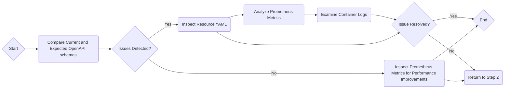

# Kubernetes Troubleshooting and Performance Improvement Guide

This guide aims to highlight potential issues with Kubernetes resource configurations and give actionable insights to optimize them.

## Step-By-Step Analysis

### 1. OpenAPI Schema Comparison

Use the OpenAPI schema definitions to compare the current state of your Kubernetes resources, as defined in your YAML files, with their expected states. If any discrepancies are found, they will be quoted from the schema documentation in the guide.

```bash
# Use Kubernetes' openapi command to download the current API definitions
kubectl proxy &
curl http://localhost:8001/openapi/v2 > openapi.yaml
```

### 2. Resource Inspection

Inspect your YAML files for any elements highlighted as requiring correction or optimization. Note these issues down.

```yaml
# Example Kubernetes Deployment YAML file
apiVersion: apps/v1
kind: Deployment
metadata:
  name: nginx-deployment
spec:
  replicas: 3  # Possible optimization: Tune this value based on your traffic patterns
  ...
```

### 3. Performance Metrics

Lastly, analyze the metrics for your Kubernetes Pods, such as CPU and memory usage, using Prometheus.

```bash
# Use kubectl to port-forward the Prometheus console
kubectl port-forward service/prometheus-k8s 9090:9090
```

### 4. Log Analysis

Examine the logs from your containers for any anomalies or errors that might lead to the pinpointing of issues.

```bash
# Get logs from the container
kubectl logs {pod-name} {container-name}
```

## Flow Chart

Here's a recommended course of action depicted as a Mermaid flow chart:



The flowchart shows the key steps in troubleshooting and performance enhancements of Kubernetes resources. 

Feel free to skip or adjust steps to suit your unique context and requirements.

---

This guide should enhance your understanding of your Kubernetes resources and the potential to improve the performance and reliability of the services running on your Kubernetes clusters.

For further information on specific resource types or generations of resources, refer to Kubernetes' [official documentation](https://kubernetes.io/docs/home/).