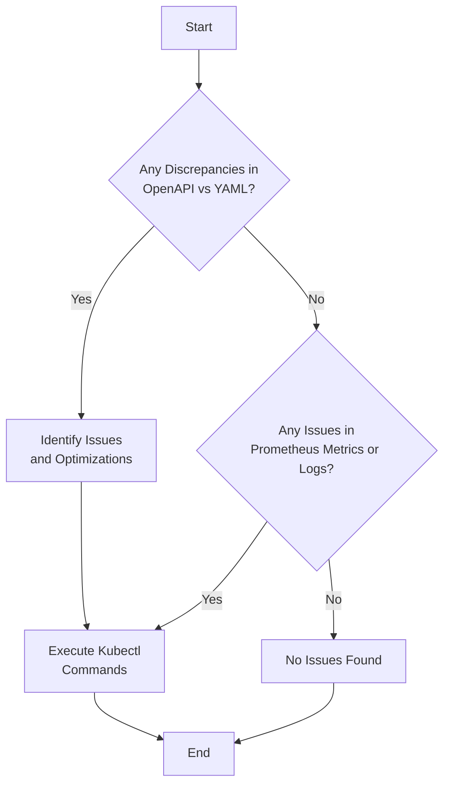

---

# Kubernetes Resources Troubleshooting Guide

This guide is designed to help you analyze and optimize your Kubernetes resources, identify potential issues, and provide actionable solutions. We will be using the OpenAPI schema definitions, Kubernetes YAML, Prometheus metrics, and container logs as input sources.

## Table of Contents

1. [OpenAPI Schema Comparison](#openapi-schema-comparison)
2. [Identify and Optimize Issues](#identify-and-optimize-issues)
3. [Step-by-step Instruction with Kubectl](#kubectl-instructions)
4. [Interpretation of Prometheus Metrics and Logs](#prometheus-metrics-logs)
5. [Troubleshooting Flowchart](#troubleshooting-flowchart)

### OpenAPI Schema Comparison <a name="openapi-schema-comparison"></a>

Regarded as the expected state of your Kubernetes resources, an OpenAPI schema comparison will highlight notable deviations. This is realized by comparing the current status of the resources, documented by the YAML file, to their OpenAPI schema equivalent. Any discrepancies discovered will be mapped, quoted, and embedded within this guide.

### Identify and Optimize Issues <a name="identify-and-optimize-issues"></a>

Problematic resource definitions are identified for immediate correction or optimization. We've injected comments and annotations within the YAML file for easy spotting of the concerns.

Here's a sample:

```yaml
apiVersion: v1
kind: Pod
metadata:
  name: my-pod
spec:
  containers:
    - name: my-container
      # Issue: Image tag not specified
      # Optimisation: Use a more lightweight image
      image: gcr.io/my-project/my-image:my-tag
      # Issue: No resource limits
      # Add "resources:
      #      limits:
      #        cpu: '0.2'
      #        memory: 200Mi" to set resource limits
      resources: {}
```

Ensure you promptly address issues and optimizations highlighted within.

### Step-by-step Instruction with Kubectl <a name="kubectl-instructions"></a>

The Kubernetes command-line tool, Kubectl, promotes efficient issue identification and resolution. Below, you'll find relevant Kubectl commands, alongside comprehensive execution steps and anticipated outcomes.

```bash
# First, identify the problematic pod
kubectl get pods

# Describe the problematic pod to understand more about the issue
kubectl describe pods <your-pod>

# Correct or optimise the problematic part of the pod, then apply the changes
kubectl apply -f <fixed-resource.yaml>
```

### Interpretation of Prometheus Metrics and Logs <a name="prometheus-metrics-logs"></a>

Prometheus metrics provide data about CPU usage, memory, and other fundamental aspects of pod performance. Understanding these metrics aid in detecting inefficient memory or CPU usage. Concurrently, insight into runtime behavior and issues can be obtained, by longing into container logs.

### Troubleshooting Flowchart <a name="troubleshooting-flowchart"></a>

Here's a concise Mermaid flowchart outlining the contained actionable steps:



---

By following this guide, you should be able to identify and resolve any underlying issues with your Kubernetes resources, and possibly optimize them-enjoy!

