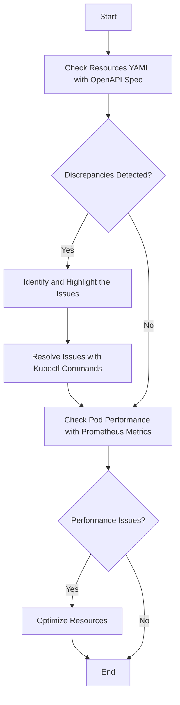

Based on the requirements and inputs, here's a generated troubleshooting user guide formatted in GitHub markdown:

# Kubernetes Troubleshooting User Guide

## Introduction

This guide will help identify potential problems with Kubernetes resource configurations based on OpenAPI schema, and provide solutions to prevent potential failures and performance degradation. We will also be using Prometheus metrics and container logs for potential issue identifications.

## Identifying Discrepancies in the Resource Definitions

We start by comparing the current state of the resources (denoted in YAML format) with the expected state from the OpenAPI schema definition. Let's consider an example Pod definition:
```yaml
apiVersion: v1
kind: Pod
metadata:
  name: my-pod
  labels:
    app.kubernetes.io/name: my-app
```
Suppose our OpenAPI specification expects an `annotation` under `metadata`.

We can highlight this discrepancy with a commented YAML like this:

```yaml
apiVersion: v1
kind: Pod
metadata:
  name: my-pod
  labels:
    app.kubernetes.io/name: my-app
 # ^^^ Missing: metadata.annotations according to OpenAPI spec
```

## Kubectl Commands

To find Pods without the required annotation, run the following command:

```bash
kubectl get pods --all-namespaces -o jsonpath='{.items[?(!.metadata.annotations)]}'
```

The output will include all the Pods that miss the required annotation.

## Performance Optimizations

Is the Pod consuming an unusual amount of CPU or memory? Check the Pod's usage with Prometheus metrics.

```bash
kubectl top pod my-pod
```

## Log analysis

Inspect the Pod logs to detect potential issues:

```bash
kubectl logs my-pod
```

Review the output logs for any error messages or any indication of high resource consumption.

## Troubleshooting Flowchart

Here's a Mermaid flowchart demonstrating the overall process:



## Conclusion

The guide has covered how to effectively troubleshoot Kubernetes resources. The process includes pinpointing discrepancies between resource definitions and OpenAPI schemas, detecting performance issues using Prometheus metrics, and resolving the problems via Kubectl commands. By following this process, you can ensure stable and optimal performance for your Kubernetes resources.