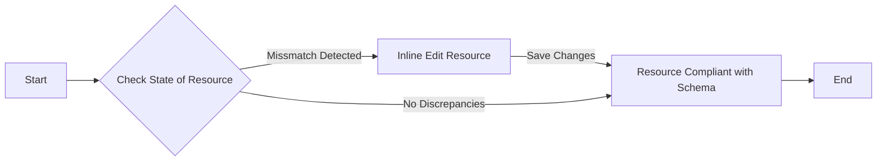

# Kubernetes Resources - Troubleshooting and Performance Improvement Guide

This guide is aimed to help diagnose the potential failures and suggest capacity improvements in Kubernetes resources. Here, we analyze resources represented in YAML format against OpenAPI schema definitions.

## OpenAPI Schema Vs. Existing Resource State

Given the OpenAPI schema and the current resource definition, we can compare them to identify any discrepancies. Let's call out with an example.

```yaml
# Current Resource State
kind: Service
apiVersion: v1
metadata:
  name: my-service
spec:
  type: NodePort # Noncompliant - The schema expects LoadBalancer
  ports: 
  - protocol: TCP
    port: 80
    targetPort: 9376
```
The OpenAPI schema states that under Service spec, the type must be a `LoadBalancer`, however, in our current state, we have set it as `NodePort`. Refer to [Kubernetes Service Documentation](https://kubernetes.io/docs/concepts/services-networking/service/#loadbalancer) for context.

## Key Showstoppers & Performance Opportunities

Highlights of key issues and performance optimizations. Comments have been provided within the YAML to give detailed insights:

```yaml
kind: Pod
apiVersion: v1
metadata:
  name: my-pod
spec:
  containers:
  - name: my-container
    image: busybox
    command: ['sh', '-c', 'echo The app is running! && sleep 3600']
    resources: # Comment: Resources not set, potential performance impact.
      requests: # Comment: CPU request not set, may lead to CPU throttling.
        memory: "64Mi"
        cpu: "250m"
      limits: # Comment: Memory limit not set, risk of Out of Memory (OOM) errors.
        memory: "128Mi"
        cpu: "500m"
```

## Actionable Fixes Using Kubectl

You may use the following commands to rectify your resource's state:

1. Verify the current state of resource:

```bash
kubectl get service my-service
```

2. Edit the resource inline:

```bash
kubectl edit service my-service
```

Replace `NodePort` with `LoadBalancer` and save the file. Now, your service is compliant with the schema.

3. Verify the changes:

```bash
kubectl get service my-service
```

The type should now display 'LoadBalancer.'

## Mermaid Flowchart

For effective comprehension of the above steps, refer to the mermaid flowchart below:


The above steps should guide you through a comprehensive resource troubleshooting process. Monitor the Prometheus metrics and review container logs for further insights.

## Conclusion

By rectifying and optimizing resource definitions, we can prohibit potential failures and greatly contribute to the resource's efficiency. The process enhances our Kubernetes infrastructure and maintains the original essence of Kubernetes resources.