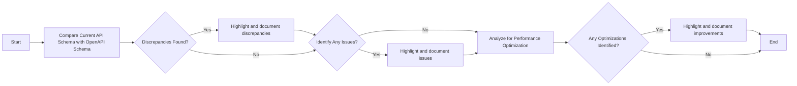

# Kubernetes Troubleshooting and User Guide 

**Objective:** This guide aims to provide clear identification of issues or potential improvements in your Kubernetes resources, actionable steps for resolution or improvement, and enhanced understanding of the Kubernetes resources. 

---

## Table of Contents 

1. [Introduction](#introduction)
2. [Schema Comparison](#schema-comparison)
3. [Identifying Issues](#identifying-issues)
4. [Performance Optimizations](#performance-optimizations)
5. [kubectl Commmands](#kubectl-commands)
6. [Troubleshooting Flowchart](#flowchart)

---

## Introduction 

In this guide, we will investigate Kubernetes resource configurations, compare them with OpenAPI schemas to identify any discrepancies. We will also highlight areas for improved performance and provide kubectl commands for resolving these issues or improvements.

This guide assumes you have existing content, notes, or analysis, the current state of Kubernetes resources in the YAML format, the expected state or definition of resources according to OpenAPI specifications, Prometheus Metrics associated with the Kubernetes Pods, and logs from the container(s) for deeper insights into runtime behavior and issues. 

---

## Schema Comparison <a name="schema-comparison"></a>

To ensure your Kubernetes resources are configured properly, a comparison is done based on OpenAPI schema definitions. Should there be any discrepancies found, they will be highlighted with the relevant parts of the schema documentation quoted for reference.

```shell
# Example of a quote from schema documentation 
apiVersion: apps/v1
kind: Deployment
metadata:
  ...
spec:
  replicas: 3  # Should be 2 according to OpenAPI Schema
  ...
```

---

## Identifying Issues <a name="identifying-issues"></a>

Issues in the YAML definitions will be clearly highlighted using comments or annotations.

```shell
apiVersion: v1
kind: Pod
metadata:
  name: mypod
spec:
  containers:
  - name: mypod
    image: nginx # Issue, image not available 
```

---

## Performance Optimizations <a name="performance-optimizations"></a>

Based on Prometheus metrics and container logs, areas requiring performance optimization or potential improvements are highlighted and suggested in this section.

```shell
# Possible performance improvement
apiVersion: apps/v1
kind: Deployment
metadata:
  ...
spec:
  replicas: 1  # Increasing the replicas can improve performance
  ...
```

---

## Kubectl Commands <a name="kubectl-commands"></a>

Here are some essential kubectl commands you might find useful:

- To display resource (pod/deployment/service) information.
```shell
kubectl get [resource]
```
- To describe a resource for more detailed information.
```shell
kubectl describe [resource]/[name]
```
- To check logs of a particular pod
```shell
kubectl logs [pod-name]
```

---

## Troubleshooting Flowchart <a name="flowchart"></a>

Here's a convenient flowchart outlining the troubleshooting process:



This completes the troubleshooting and user guide for Kubernetes resources. Following these guidelines should ensure your deployments run smoothly, are optimized for performance, and any discrepancies or issues are quickly resolved. Happy Deploying!